

# Introduction

## Recipe

A Workato recipe is a set of predefined instructions to be executed. It is made up of a trigger and one or more actions.

It execute a variety of tasks to all the applications supported by the Workato platform.

## Trigger

Defines an event that triggers the execution of a Workato recipe

## Action

Steps that will be executed when a recipe is triggered.

There are 4 types of actions:

1.  **Action**
  - Basic actions perform tasks like Search, Create, Update
2. **Conditional action**
  - These actions behave like traffic control. They provide users with the capability to restrict certain actions based on conditions.
  - Example: Create a new Account only if it does not already exist
3. **Repeat action**
  - Repeat actions are simple loops. They perform predefined tasks multiple times based on an array (list) of records.
  - Example: Add line items in QuickBooks for each opportunity item in Salesforce
4. **Stop**
  - Allows users to terminate a run of the recipe (a job). This is useful if you wish to stop performing any actions if a certain condition is met.
  - Optionally, you can define an error for this action. What this does is let you generate exceptions in certain scenarios. These jobs that stops with errors will show up in job history as errors

## Adapter

An Adapter is a connector to an application. Each Adapter has one or more trigger and actions. When an action or trigger is executed, it performs it's respective function with the account instance connected to that application.

# Connector SDK

## Custom Adapters

Connectors, also known as **custom adapters** built on the SDK have private scope. This means that the functions made available by this will only be visible to the workato account.

To enable global scope for this connector, please submit a pull request to our [repository](https://github.com/workato/connector_sdk).

## Requirements

### REST Architecture

Presently, only RESTful APIs are supported by the Connector SDK.

### JSON Format

Presently, only JSON type data is supported by the Connector SDK.

### Bonus

#### Pagination

Pagination helps with response data that is more manageable. It is definitely a bonus if the intended API supports that.

#### Query

It is very useful to be able to query resources instead of locating them based on IDs. With Search by query, the API allows you to return a list of results that matches your field criterias. You may also want to look out for the ability to query based on created/updated time which will be crucial when building out your triggers.

## Authentication

### Basic Authentication

#### Standard

Typically, a basic authentication requires a username and password combination when making requests. Make sure to include those two fields in the connection fields definition.

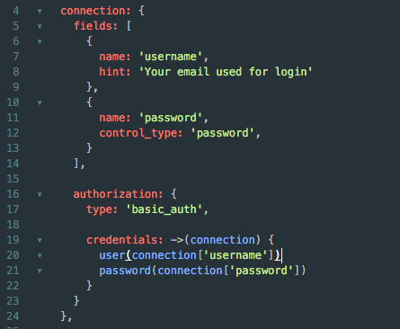

To set up a basic authentication, simply define type: ‘basic_auth’ and include the appropriate values in `user()` and `password()` in the credentials section.

#### Variations

Some APIs expect different conventions from a standard basic authentication.

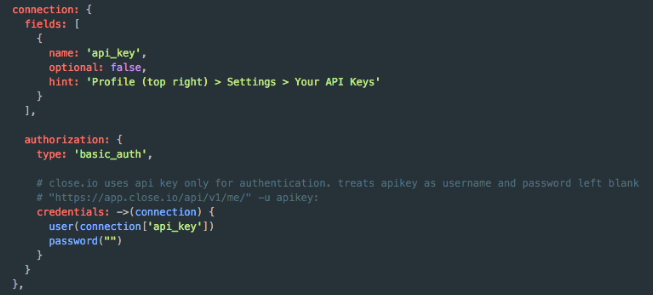

In this example Close.io API expects an API Key generated inthe individual User’s account. It should be used as a username with a blank password in the standard basic authentication format.

So, to adjust the connections portion of the code to suit this behaviour, simply request for an API instead of username + password.

In the credentials section, pass the api_key into `user()` and an empty string (“”) to `password()`

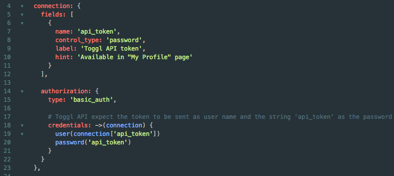

Another variation is to have a generated api_token replace the user name and have the string “api_token” replacing password in the basic authentication format.

### API Key Authentication

For APIs that expect API Key authentication, it is a slight variation from the basic authentication code above.

Make sure to include the required inputs from the user (subdomain, api_key, scope etc)

Define
1. type: ‘api_key’
2. the appropriate parameter name for the api_key. In this case, it is simple “api_key”

After defining this, calls will have the appropriate params appended.

Example:
> \<BASE_URL>/users?api_key=NB674921

### OAuth 2.0

For a more secure method of authentication, we recommend using OAuth 2.0. It is an open standard and is generally a more secure way for users to log into third party websites without exposing their credentials.

The Workato connector SDK currently supports the authorization code grant variant of the OAuth2 standard.

Required components in OAuth 2.0 type connection
1. Type (defined as ‘oauth2’)
2. Authorization_url
3. Token_url
4. Client_id and client_secret
5. Credentials

Redirect URI will be appended to the authorization request by the framework, so there is no need to include it. If the application requires that you register the redirect URI beforehand, use:
https://www.workato.com/oauth/callback

Adjust headers format as required in the credentials section

For example, Pushbullet expects the header to include token in this format:
> Access-Token: \<access token>

So to adjust to suit this requirement, define the credentials portion like so:

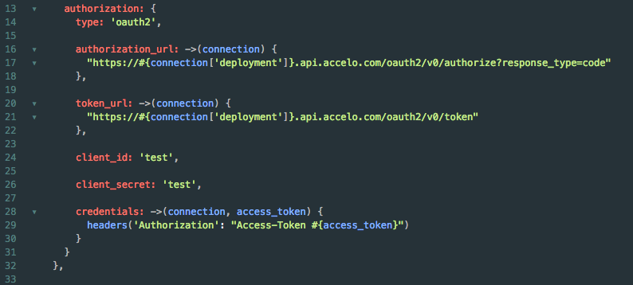

Note:
SDK makes a POST request to token endpoint. Will not currently work for APIs expecting a different type of request.

## Action

### Endpoints

An action can make one or more requests to various endpoints. Because the framework handles the authentication side of a request, you will not have to worry about that here.

The most important thing is to identify which endpoint will address the purpose of the action. Here we will take a look at Close.io’s Lead object and how to retrieve it via the API

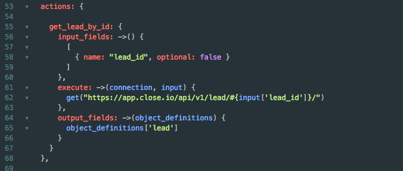

A very simple action looks like this. A get request to the Close.io leads endpoint. In this case, the particular lead’s details is appended in the endpoint.

### Parameter / Payload

Other endpoints require parameters to access certain details, instead of accessing a particular resource route.

A GET request can have parameters added to the request like so:

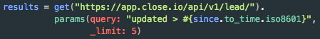

A POST or PUT or PATCH request can have payloads attached as well. There are 2 ways you can do this.

Add payloads to the method
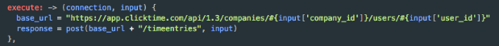

Add payloads using the payload method
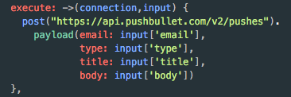

### Methods

Not all ruby public instance methods are available. Methods are whitelisted to ensure security. The Workato SDK Framework also exposes some methods to make building SDKs convenient.

Here is a list of methods available:

REST verb methods (inputs are expected to be in JSON format)
- get(url)
- post(url, input)
- put(url, input)
- patch(url, input)

Ruby methods
- each
- group_by
- headers
- ignored
- inject
- iso8601
- lambda
- map
- merge
- only
- params
- password
- payload
- pluck
- rand
- reject
- required
- select
- sort
- sort_by
- user
- utc
- puts (ruby’s console.log/stdout, not the same as put)
- while

(I may have missed some, feel free to contact [me](eeshan@workato.com) to update this list)

## Trigger

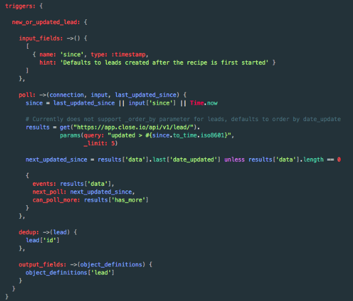

### type (optional)

`:paging_desc`: Descending order feature that sorts events (below)

### poll

Poll block is where you can define the behaviour of the trigger. It accepts [ruby syntax](http://ruby-doc.org/).

`since`: This parameter acts as a filter for the trigger. Typically, it is a datetime type data that tells the trigger to pick up events/records after a certain date and time.

It is usually a datetime type data. It can also take on record IDs, assuming that IDs are always incremental.

Order: SDK supports ascending or descending order in requests

### events

Array of records to be processed. Each event should be a record to be processed in the recipe.

### next_poll / next_page

This is a nifty feature that allows the Workato Trigger Framework to recognise the last poll state. This will be used in consecutive polls to ensure that no data is re-polled.

This value is passed to the next poll as the `Since` parameter.

### can_poll_more (optional)

This is a boolean type component. It tells the Workato Trigger Poll Framework whether to trigger another poll. It is typically used to mark if there are more “pages” of records to be picked up.

### dedup

Dedup component is basically to identify individual records. This component is given the parameter “event”, which corresponds to individual items in the array passed into “Events”.

A typical dedup input is event[‘id’] where event is replaced make the code more readable.

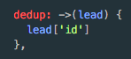

In this case, the trigger handles leads. Individual leads can be identified by their unique ids lead[‘id’].

## Object Definition

Object Definitions is an important component of the SDK. It allows you to define your schema for objects to be used in the actions and triggers. It allows you to easily define outputs and inputs later on.

### Static Definition

The most basic way to build an object definition is to define the field name and type

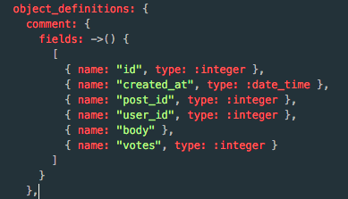

In this example, the object “Comment” is being defined. It has 6 fields. The fields are all defined in the fields lambda literal `->()`

Defined as an array of objects. Each field object corresponds to a field in the comment object.

### Dynamic Definition

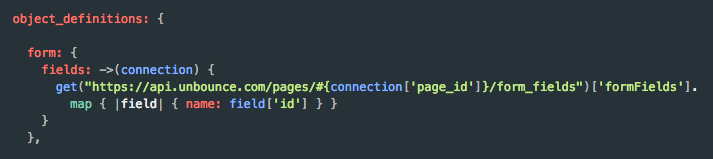

### Components

Key | Definition
--- | ----------
name | The name of this field. For example `id` or `created_at`
type | The data type of this field. Default value is string
control_type | The input field type to expose in a recipe.
pick_list | If control type is 'select', this component is  required. See more in **Pick List**
properties | When defining nested objects, use the properties key to define the fields in the object. Remember to define the type as `:array` or `:object`

#### type
It should be given the symbol notation (prepend colon)

Supported types:
`:string`, `:integer`, `:datetime`, `:date`, `:boolean`, `:object`, `:array`

`:object`, and `:array` must be accompanied with properties

#### control_type

Some of the available values are
‘url’: the data field will show a link
‘select’: the data field will be a pick list (make sure to include the pick_list property

Other supported types:
timestamp, checkbox, phone, email, text, number, text-area

## Test

Test endpoint to ensure that connection is successful.

Typically, this should be a request that will always be accessible to any user.

Here are some examples:

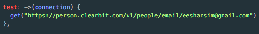

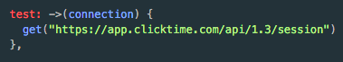

# Example Adapters

## Basic Authentication
- [Harvest app connector](https://github.com/workato/connector_sdk/blob/master/basic_auth/harvest_connector.rb)

- [Freshdesk connector](https://github.com/workato/connector_sdk/blob/master/basic_auth/freshdesk_connector.rb)

- [Clearbit connector](https://github.com/workato/connector_sdk/blob/master/basic_auth/clearbit_connector.rb)

- [Close.io connector](https://github.com/workato/connector_sdk/blob/master/basic_auth/close_io_connector.rb)

- [Click Time connector](https://github.com/workato/connector_sdk/blob/master/basic_auth/click_time_connector.rb)

- [Toggl connector](https://github.com/workato/connector_sdk/blob/master/basic_auth/toggl_connector.rb)

- [Unbounce connector](https://github.com/workato/connector_sdk/blob/master/basic_auth/unbounce_connector.rb)

## OAuth2
- [Podio connector](https://github.com/workato/connector_sdk/blob/master/oauth2/podio_connector.rb)

- [ProductHunt connector](https://github.com/workato/connector_sdk/blob/master/oauth2/producthunt_connector.rb)

- [Accelo connector](https://github.com/workato/connector_sdk/blob/master/oauth2/accelo_connector.rb)

- [Pushbullet connector](https://github.com/workato/connector_sdk/blob/master/oauth2/pushbullet_connector.rb)

## Custom Authentication
- [LoJack app connector](https://github.com/workato/connector_sdk/blob/master/custom_auth/lo_jack_connector.rb)

- [SafetyCulture app connector](https://github.com/workato/connector_sdk/blob/master/custom_auth/safetyculture_connector.rb)
